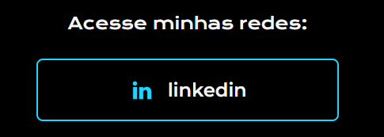
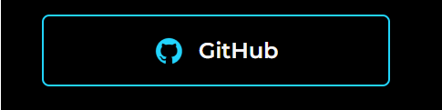
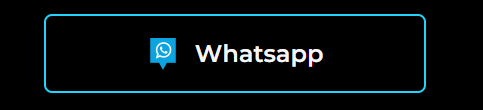

## _"I am a technology enthusiast, Junior programmer, maker, and passionate problem solver"._

  
  

# About Me:
## 👋 Hello! Welcome to my profile!
I am Oziel Sousa, a Junior Developer passionate about technology and problem-solving. At 34 years old, I am committed to creating creative solutions through software development.

# Skills:
- Web development with HTML, CSS, and JavaScript.
- Programming in Python and Java.
- Usage of frameworks like React and Node.js.
- Automation of tasks with scripts.
- Git and version control.
- Programming problem-solving.
- Collaboration on open-source projects.

# Most Used Languages:
| | | |
| :---: |  :---: |  :---: |
|  &nbsp; &nbsp; &nbsp; &nbsp; &nbsp; |  |  &nbsp; &nbsp; &nbsp; &nbsp; &nbsp; |

Currently, I am exploring new technologies and expanding my skill set. My goal is to contribute to the open-source community and continue learning.
------
<table >
  <tr align="center">
    <td ></td>
    <td></td>
    <td></td>
    <td></td>
    <td></td>
    <td></td>
    <td></td>
    <td></td>
    <td></td>
    <td></td>
    <td></td>
  </tr >
  <tr align="center" >
   <td>HTML5 </td>
    <td>CSS3 </td>
    <td>JavaScript </td>
    <td>ReactJS </td>
    <td>JQuery </td>
    <td>Java </td>
    <td>PHP </td>
    <td>SQL </td>
    <td>Python</td>
    <td>GitHub </td>
    <td>VS Code</td>
   </tr>
</table>

# Contact Me:
**If you're interested in collaborating on projects or discussing technology, please feel free to reach out to me.**
------

# My Resumes:
**If you're interested in learning more about my experience and skills, feel free to:**
------

**"Enjoy some fun with this exciting game! 😄🎮"**
------

<!--

-->
